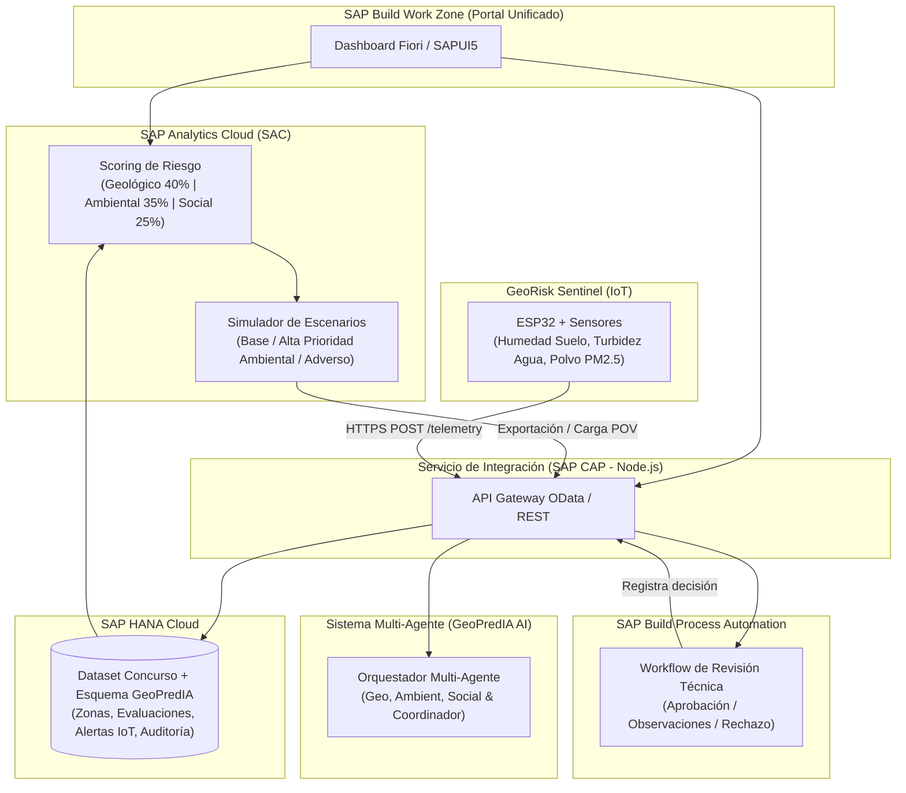

# 🌍 GeoPredIA — GeoRisk Decision Hub

> **Plataforma Integral de Evaluación de Riesgos Geológicos, Socioambientales y Simulación de Escenarios para Zonas de Exploración Minera**
> 
> *Proyecto desarrollado para la Hackathon **ULatinHack - Reto Oficial GeoRisk**.*

---

## 📋 Tablas de Contenidos
- [1. Propuesta del Proyecto](#1-propuesta-del-proyecto)
- [2. ¿Qué es SAP y por qué es clave en GeoPredIA?](#2-qué-es-sap-y-por-qué-es-clave-en-geopredia)
- [3. Arquitectura del Sistema](#3-arquitectura-del-sistema)
- [4. Estructura del Repositorio](#4-estructura-del-repositorio)
- [5. Modelo de Evaluación y Scoring](#5-modelo-de-evaluación-y-scoring)
- [6. Sistema Multi-Agente con IA (GeoPredIA AI)](#6-sistema-multi-agente-con-ia-geopredia-ai)
- [7. Extensión IoT: GeoRisk Sentinel](#7-extensión-iot-georisk-sentinel)
- [8. Reparto de Trabajo y Equipo (5 Personas)](#8-reparto-de-trabajo-y-equipo-5-personas)
- [9. Guía de Inicio Rápido](#9-guía-de-inicio-rápido)

---

## 1. Propuesta del Proyecto

**GeoPredIA (GeoRisk Decision Hub)** ayuda a especialistas, geólogos y comités técnicos a comparar zonas de exploración minera, comprender cuantitativa y cualitativamente qué factores generan riesgo y registrar decisiones sustentadas e inmutables.

Cada evaluación en GeoPredIA responde a:
1. **¿Qué riesgos geológicos, ambientales y sociales presenta la zona?**
2. **¿Qué datos y evidencia científica respaldan el resultado?**
3. **¿Cómo cambia la evaluación bajo escenarios y supuestos alternativos?**
4. **¿Qué información faltante o alertas ambientales deben ser atendidas?**
5. **¿Quién revisó la evaluación y cuál fue la justificación técnica de la decisión?**

---

## 2. ¿Qué es SAP y por qué es clave en GeoPredIA?

### ¿Qué es SAP?
**SAP** (*Systemanalyse Programmentwicklung*) es la plataforma de software empresarial y analítica en la nube líder a nivel mundial. Proporciona herramientas de procesamiento de datos en tiempo real, inteligencia de negocios y gobernanza corporativa.

### SAP en GeoPredIA:
En este proyecto, la suite **SAP Business Technology Platform (SAP BTP)** y **SAP Analytics Cloud (SAC)** garantizan el cumplimiento de las exigencias del reto GeoRisk:

- 🗄️ **SAP HANA Cloud**: Base de datos *in-memory* que consolida el dataset común del concurso y registra la telemetría IoT y revisiones.
- 📊 **SAP Analytics Cloud (SAC)**: Motor de scoring que calcula los índices ponderados de riesgo (Geológico, Ambiental, Social) y permite simulaciones de sensibilidad en tiempo real.
- ⚙️ **SAP Build Process Automation (BPA)**: Workflow de gobernanza que gestiona las solicitudes de revisión técnica, aprobación y rechazo justificado.
- 🚪 **SAP Build Work Zone (Standard Edition)**: Portal unificado basado en SAP Fiori para otorgar acceso seguro según el rol del usuario (Analista, Revisora, Administrador).
- 🔌 **SAP CAP (Cloud Application Programming Model)**: Servicio de integración Node.js que conecta SAC, HANA, BPA, la IA Multi-Agente y las unidades IoT.

---

## 3. Arquitectura del Sistema



---

## 4. Estructura del Repositorio

```
GeoPredIA/
├── README.md                      # Documentación ejecutiva principal
├── LICENSE                        # Licencia MIT
├── docs/                          # Guías conceptuales y técnicas
│   ├── ARCHITECTURE.md            # Diagramas y flujos de arquitectura detallados
│   ├── SAP_GUIDE.md               # Manual de uso e integración con SAP BTP y SAC
│   ├── TEAM_ROLES.md              # Matriz de roles y responsabilidades (5 integrantes)
│   ├── MULTI_AGENT_AI.md          # Especificación de agentes inteligentes
│   └── IOT_SENTINEL.md            # Hardware, calibración y protocolo HTTPS
├── database/                      # Scripts DDL/CDS para SAP HANA Cloud
├── analytics/                     # Definiciones de modelos y formulas SAC
├── backend/                       # Servicio SAP CAP (Node.js/Express)
├── frontend/                      # App SAPUI5 / Portal Fiori
├── workflows/                     # Definiciones de flujo en SAP Build Process Automation
├── agents/                        # Servicio Python con Framework Multi-Agente (FastAPI)
└── iot/                           # Firmware ESP32 (C++) y Simulador de Telemetría (Python)
```

---

## 5. Modelo de Evaluación y Scoring

El cálculo del **Índice Global de Riesgo** combina tres dimensiones fundamentales:

$$\text{Riesgo Global} = 0.40 \times \text{Riesgo Geológico} + 0.35 \times \text{Riesgo Ambiental} + 0.25 \times \text{Riesgo Social}$$

### Sensibilidad de Escenarios
1. **Escenario Base**: Ponderación estándar (40% Geo / 35% Env / 25% Soc).
2. **Escenario Alta Prioridad Ambiental**: Reajuste de sensibilidad (25% Geo / 50% Env / 25% Soc).
3. **Escenario Adverso Hipotético**: Incremento de severidad en variables críticas ante sequía o sismicidad elevada.

---

## 6. Sistema Multi-Agente con IA (GeoPredIA AI)

Para ir más allá del cálculo numérico, GeoPredIA incorpora un equipo de 4 agentes especializados:

- 🪨 **Agente Geológico**: Evalúa riesgos de estabilidad de terreno, tipo de roca y nivel de incertidumbre.
- 🌿 **Agente Ambiental**: Audita la calidad del agua, dispersión de polvo y lecturas anómalas de sensores.
- 🤝 **Agente Social**: Analiza conflictos históricos, acuerdos comunitarios y nivel de licencia social.
- 🧠 **Agente Coordinador**: Sintetiza los reportes, detecta contradicciones y redacta la recomendación técnica final para el especialista.

---

## 7. Extensión IoT: GeoRisk Sentinel

Dispositivo de monitoreo de campo en tiempo real conectado via **HTTPS TLS** a SAP CAP:
- **ESP32 Microcontroller**: Unidad central con conectividad WiFi.
- **Sensor SEN0193**: Medición capacitiva de humedad de suelo (previene falso riesgo por corrosión).
- **Sensor TS-300B**: Turbidez de agua en fuentes cercanas a la zona de exploración.
- **Sensor GP2Y1010AU0F / SDS011**: Concentración de partículas de polvo PM2.5 en suspensión.

---

## 8. Reparto de Trabajo y Equipo (5 Personas)

| Integrante | Rol | Responsabilidad Principal | Entregable Clave |
| :--- | :--- | :--- | :--- |
| **Persona 1** | **Base de Datos & SAP HANA** | Modelado DDL/CDS, ingesta y limpieza del dataset oficial en HANA Cloud. | Vistas SQL y tablas de esquemas listas en HANA. |
| **Persona 2** | **Scoring & SAP Analytics (SAC)** | Implementación del modelo de scoring, dashboards interactivas y escenarios de sensibilidad. | Dashboard SAC completo con exportación POV. |
| **Persona 3** | **Workflows & SAP Process Automation** | Diseño de formularios de revisión técnica y orquestación del flujo de aprobación. | Workflow BPA activo con logs de auditoría. |
| **Persona 4** | **Integración, Work Zone & CAP** | Desarrollo del servicio SAP CAP (Node.js), configuración de Work Zone Fiori y APIs. | Portal unificado funcional y conector OData/REST. |
| **Persona 5** | **Multi-Agentes IA, IoT & Demo** | Desarrollo del firmware ESP32 / simulador IoT, agentes de IA en Python y ensayo de la demo. | Sistema Multi-Agente + Unidad IoT GeoRisk Sentinel. |

---

## 9. Guía de Inicio Rápido

### Prerequisitos
- Node.js >= v18.x
- Python >= 3.10
- Git

### Ejecución del Simulador IoT (Sin Hardware)
```bash
cd iot/simulator
python iot_simulator.py
```

### Ejecución del Servicio Multi-Agente de IA
```bash
cd agents
pip install -r requirements.txt
python main.py
```

---

*Desarrollado con pasión para ULatinHack por el equipo GeoPredIA.* 🚀
