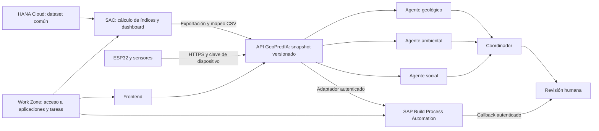

# GeoPredIA · GeoRisk Decision Hub

**Evaluación explicable de riesgos geológicos, ambientales y sociales para zonas de exploración minera.**

Proyecto para el reto **GeoRisk — HKT-2026-T2, ULatinHack 2026**. Ayuda a comparar zonas, explicar qué evidencia respalda cada evaluación y registrar una decisión humana con su justificación.

## Qué puedes ejecutar hoy

- Frontend en español con panorama de zonas, comparación de tres dimensiones y escenarios ilustrativos.
- Tres agentes especialistas (geológico, ambiental y social) y un coordinador. Funcionan por reglas sin claves; Groq es opcional.
- Importación de snapshots CSV ya calculados en SAP Analytics Cloud, conservando sus valores.
- Revisión humana por versión, historial de ejecuciones, decisiones y eventos de auditoría.
- Recepción autenticada de telemetría, simulador y firmware del kit ESP32 de aproximadamente **S/88.30**.
- Adaptadores para leer una vista de SAP HANA, publicar registros en un esquema del equipo y enviar evaluaciones a SAP Build Process Automation.

**Estado real:** la aplicación local es funcional. Las seis zonas iniciales son ficticias y no son el dataset común del concurso. SAP HANA, SAC, BPA y Work Zone requieren configuración y verificación en el tenant del evento. Tener un adaptador no equivale a haber desplegado esos servicios. El firmware necesita compilación y prueba en la placa física.

## Inicio rápido — Windows

Necesitas Python 3.12 y acceso a una terminal en esta carpeta.

```powershell
python -m venv .venv
.\.venv\Scripts\python.exe -m pip install -r requirements.txt
Copy-Item .env.example .env
.\.venv\Scripts\python.exe -m uvicorn agents.api:app --host 127.0.0.1 --port 8000 --no-proxy-headers
```

Abre **http://127.0.0.1:8000**. API documentada en **http://127.0.0.1:8000/docs**. No necesitas Node, Docker, un LLM ni una cuenta SAP para ejecutar el modo local. La información se guarda en `.local/geopredia.db`; reiniciar conserva los datos.

Linux/macOS: usa `python3 -m venv .venv` y `.venv/bin/python` en los comandos anteriores. Puedes copiar la configuración con `cp .env.example .env`.

### GitHub Pages

`index.html` abre `frontend/console/index.html`. En Pages se muestra una **vista estática de demostración**, con datos de ejemplo y operaciones deshabilitadas. Para ejecutar agentes, guardar decisiones o recibir sensores, inicia el backend local. GitHub Pages no ejecuta Python ni aloja SAP.

## Arquitectura



La API local usa **FastAPI + SQLite** para poder ensayar sin infraestructura adicional. `POST /api/integrations/hana/publish` replica los registros pendientes en `GPI_EVENT_STORE` del esquema del equipo, de forma explícita e idempotente; no escribe en el dataset común. El scoring oficial debe implementarse **dentro de SAC**. Las tablas del equipo en HANA y el flujo BPA se configuran según [la guía SAP](docs/SAP_GUIDE.md); el prototipo local no los sustituye en la entrega del concurso.

## Cómo se evalúa el riesgo

La demo usa subíndices ficticios de 0 a 100 y pesos ilustrativos `40 % geológico + 35 % ambiental + 25 % social`. El panel permite comparar una nueva versión con otros pesos que sumen 100 %. La clasificación de ejemplo es bajo `<40`, medio `40–69.99` y alto `>=70`.

Estos pesos y umbrales **no están validados científicamente**. Deben justificarse con las variables del dataset del evento antes de implementarlos en SAC. Las restricciones críticas deben revisarse separadamente del promedio. Riesgo no equivale a rentabilidad.

- Una dimensión ausente produce un global ausente, nunca cero.
- Una evaluación importada no se recalcula en Python ni con un LLM.
- El CSV conserva modelo, dataset, fecha y valores. Su origen declarado como SAC todavía necesita verificación humana.
- Las mediciones IoT complementan la evidencia; no modifican automáticamente el score.
- Se conserva cada versión. Una decisión no se sobrescribe: se crea una nueva evaluación para una nueva revisión.

Ver [modelo SAC](analytics/sac_model_spec.md) y [contrato de exportación](analytics/sac_snapshot_contract.md).

## Multiagentes: adaptación del proyecto financiero

Implementación original inspirada en el patrón del [repositorio de agentes financieros](https://github.com/Alpaca-AI-Trading-Hackhaton-lablab-ai/alpaca-ai-trading-agents-hackathon-lablab.ai): agentes especializados, salidas estructuradas, registro de ejecución y separación de explicación frente a autorización. No se copiaron archivos de ese proyecto ni se usan sus credenciales o servicios de inversión.

| Rol | Evidencia que considera | Resultado |
|---|---|---|
| Geológico | Subíndice y evidencias geológicas | Factores a revisar, incertidumbre y datos faltantes |
| Ambiental | Evidencias ambientales y telemetría de la zona | Observaciones, procedencia y necesidad de línea base |
| Social | Evidencias sociales documentadas | Aspectos que requieren consulta y revisión humana |
| Coordinador | Hallazgos de los tres especialistas | Resumen y razones de revisión, conservando el score |

Sin claves, el panel indica **agentes por reglas**. Para activar el LLM, configura `LLM_ENABLED=true` y `GROQ_API_KEY` únicamente en `.env`. El modelo solo selecciona enfoques y referencias existentes mediante JSON validado. No recibe autoridad para modificar scores ni aprobar una zona. Fallos del proveedor o referencias inventadas activan un fallback explícito a reglas. Las solicitudes pueden consumir cuota del proveedor.

## IoT de S/100

**ESP32 + DHT11 + humedad capacitiva de suelo v1.2 + sonda DS18B20.** Mide temperatura/humedad del aire, cambios relativos de humedad del suelo y temperatura del agua. No mide pH, turbidez, metales ni PM2.5.

1. Define `DEVICE_API_KEY` en `.env` y reinicia la API.
2. Configura el simulador con la misma clave en `GEOPREDIA_DEVICE_KEY`.
3. Prueba una lectura sintética:

```powershell
# Define GEOPREDIA_DEVICE_KEY localmente; no la pegues en documentación ni commits.
python iot/simulator/sentinel_simulator.py --url http://127.0.0.1:8000/api/telemetry --zone-id Z-001 --once
```

El botón del frontend también genera una muestra claramente sintética, sin hardware. [Presupuesto, conexiones y calibración](docs/IOT_SENTINEL.md). El firmware envía valores nulos ante fallos, exige certificado CA para HTTPS y usa ADC1 para evitar el conflicto con Wi-Fi.

## Organización

```text
agents/                 API, modelos, motor multiagente y adaptadores SAP
frontend/console/       Interfaz HTML/CSS/JS sin dependencias ni CDN
analytics/              Modelo SAC, mapeo de variables y CSV de ejemplo
database/src/           DDL para tablas propias del equipo en HANA
workflows/              Blueprint BPA y esquema del callback
iot/                    Firmware, simulador y pruebas de transporte
docs/                   Arquitectura, SAP, equipo, IoT y guion de demo
tests/                  Pruebas de API, agentes y reglas de integridad
scripts/                Inicio local y utilidades de entrega
```

Los directorios iniciales `backend/` y `frontend/webapp/` del repositorio pueden mantenerse como antecedentes. La entrada verificada de esta versión es **`agents.api:app` + `frontend/console/`**. Un nombre de carpeta CAP o un archivo CDS por sí solos no constituyen un despliegue SAP CAP.

## Validación

[Resultados y alcance de la validación](docs/VALIDATION.md).

```powershell
.\.venv\Scripts\python.exe -m unittest discover -s tests -v
.\.venv\Scripts\python.exe -m unittest discover -s iot/simulator -p "test_*.py" -v
node --check frontend/console/app.js
```

Las pruebas cubren datos faltantes, versiones, importación SAC sin recálculo, referencias de agentes, autenticación IoT, repetición de lecturas y decisiones, y correspondencia de instancia BPA. No invocan servicios de pago. Las integraciones SAP y el firmware requieren pruebas adicionales en el entorno correspondiente.

### Paquete y publicación desde una terminal autenticada

`python scripts/package.py` crea un ZIP de fuentes y un manifiesto de hashes, excluyendo credenciales y datos locales. Si la publicación desde el entorno de trabajo está bloqueada, `./scripts/publish.ps1` puede ejecutarse en una terminal normal con Git y tu cuenta autorizada. Clona el repositorio, comprueba la versión base revisada, aplica solo los archivos del paquete, crea un commit con tu identidad de Git y hace un push normal a `main`. Si el remoto cambió, se detiene para integrar ese trabajo; no fuerza cambios ni reescribe historial. El script no inicia sesión ni solicita tokens dentro del proyecto.

## Equipo y demo

- [Reparto entre cinco personas y dependencias](docs/TEAM_ROLES.md)
- [Arquitectura y decisiones técnicas](docs/ARCHITECTURE.md)
- [Guion de demo de tres minutos](docs/DEMO.md)
- [Pasos SAP y límites del prototipo](docs/SAP_GUIDE.md)

La revisión local usa el nombre escrito por el especialista y no verifica su identidad. Para una entrega desplegada, integrar la identidad y roles del tenant SAP, HTTPS y almacenamiento HANA de las revisiones. No publicar el servidor local sin configurar autenticación.
