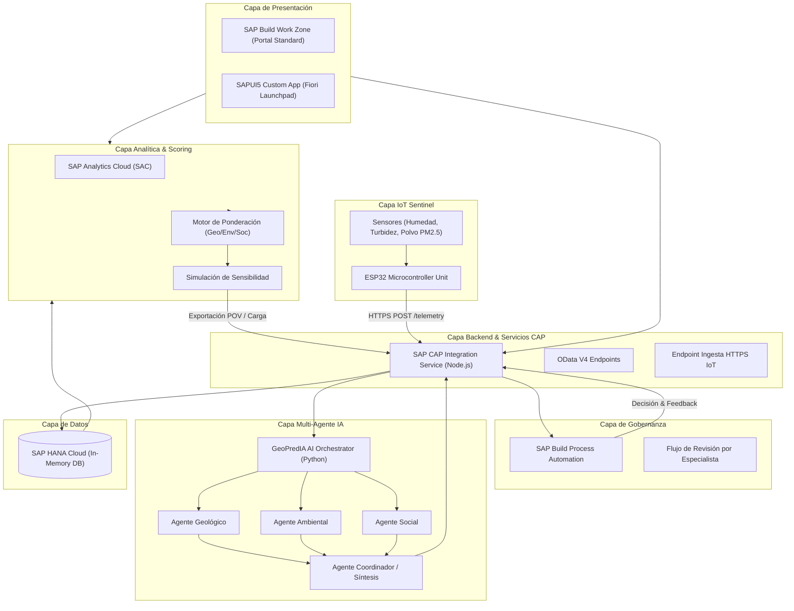

# 🏛️ Arquitectura del Sistema GeoPredIA

## Visión General
GeoPredIA (GeoRisk Decision Hub) integra servicios analíticos, gobernanza de procesos, inteligencia artificial multi-agente e ingesta de IoT en tiempo real sobre la infraestructura de SAP Business Technology Platform (SAP BTP).

## Flujo End-to-End de una Evaluación
1. **Ingesta e Integración**: SAP HANA Cloud almacena el dataset unificado del reto GeoRisk.
2. **Cálculo de Scoring**: SAC consulta HANA Cloud y aplica la fórmula dimensional de riesgo (40% Geológico, 35% Ambiental, 25% Social).
3. **Simulación de Escenarios**: El especialista interactúa en SAC probando supuestos alternativos (Escenario Base, Alta Prioridad Ambiental, Adverso).
4. **Registro y Carga POV**: Se exporta el estado visible de la tabla analítica (Point of View) y se registra en la aplicación de integración SAP CAP.
5. **Evaluación Multi-Agente**: La API de CAP envía la evaluación al sistema Multi-Agente de IA, el cual genera explicaciones cualitativas detalladas por dimensión.
6. **Revisión en SAP BPA**: El resultado y la explicación de los agentes inician una solicitud de revisión técnica en SAP Build Process Automation.
7. **Monitoreo IoT Continuo**: Los sensores GeoRisk Sentinel envían lecturas periódicas. Si un sensor detecta turbidez anormal o saturación de humedad en suelo, emite una alerta automática hacia CAP que escala una nueva revisión en BPA.
8. **Decisión e Histórico**: El especialista aprueba, observa o rechaza la evaluación, quedando registrada con firma de usuario y versión del modelo en HANA Cloud.
