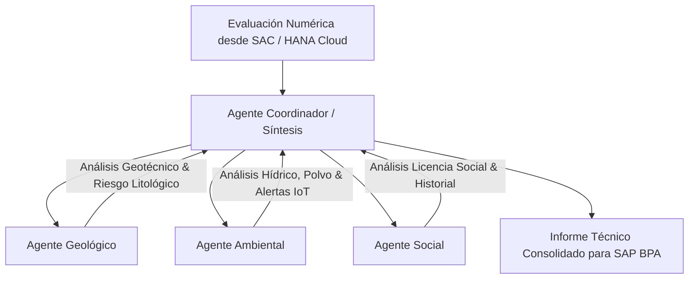

# 🤖 Especificación del Sistema Multi-Agente de IA (GeoPredIA AI)

## 1. Visión General
El sistema **Multi-Agente de GeoPredIA** actúa como un comité técnico automatizado que analiza los datos numéricos producidos por **SAP Analytics Cloud (SAC)** y los convierte en una evaluación cualitativa explicable con evidencias citadas.

---

## 2. Agentes Especializados

### 2.1 Agente Geológico (`GeoAgent`)
- **Entradas**: Pendiente del terreno, densidad de fallas estructurales, índice de alteración hidrotermal, nivel de incertidumbre del recurso.
- **Salida**: Diagnóstico de estabilidad física, riesgos de deslizamiento y recomendaciones de perforación adicional.

### 2.2 Agente Ambiental (`EnvAgent`)
- **Entradas**: Turbidez hídrica, concentración de partículas PM2.5, distancia a zonas de protección de biodiversidad, telemetría IoT del sensor SEN0193 / TS-300B.
- **Salida**: Identificación de alertas ambientales críticas y sugerencias de mitigación.

### 2.3 Agente Social (`SocAgent`)
- **Entradas**: Acuerdos comunitarios vigentes, actas de diálogo, número de eventos de tensión registrados.
- **Salida**: Evaluación del nivel de licencia social y mapa de compromisos pendientes.

### 2.4 Agente Coordinador (`CoordinatorAgent`)
- **Rol**: Integrar las 3 evaluaciones especializadas.
- **Comprobación de Reglas**:
  - Si la dimensión ambiental o geológica presenta una alerta roja, el reporte final escala el nivel de prioridad independientemente del promedio ponderado.
- **Salida**: Resumen Ejecutivo estructurado en Markdown formateado para incrustar en el formulario de **SAP Build Process Automation**.
